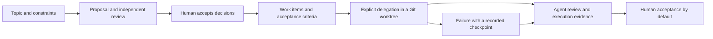
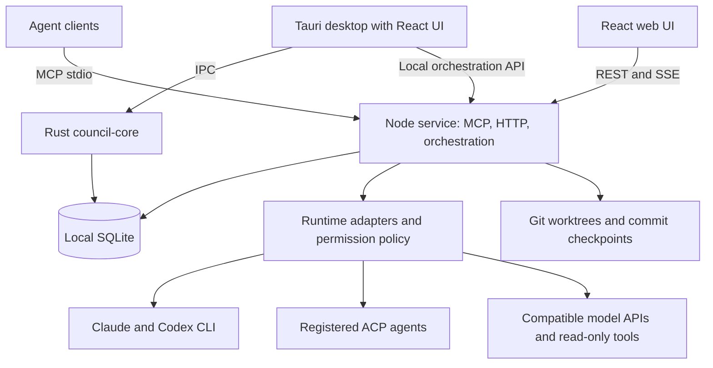

<p align="center"></p>

# Council

**A local workspace where coding agents challenge proposals, record decisions, and deliver work with evidence.**

English · [简体中文](README.zh.md)

Council connects Claude, Codex, and other configured agents around the same project and topic. Move from a proposal to independent review, a human decision, and isolated implementation without manually ferrying messages between chat windows.

The current desktop release is **0.9.2**. The desktop packaging configuration supports macOS Apple Silicon and Intel; the current release has been validated on Apple Silicon. Windows and Linux desktop packages are not provided by the current build configuration.

## Why Council?

Using several capable agents often leaves the coordination work to you:

| The friction | What Council provides |
|---|---|
| Copying one agent's answer into another chat loses context and takes time. | A shared topic with explicit proposals, critiques, rebuttals, and synthesis, accessible through the desktop UI or MCP. |
| Agents agree, but nobody records what was actually accepted. | Proposed decisions remain proposals until a human accepts them; accepted decisions become a traceable decision package. |
| “Done” can mean anything from an idea to a tested change. | Work items have frozen acceptance criteria, execution evidence, and an explicit completion policy. New delegations default to human acceptance. |
| A failed run leaves you unsure what changed or whether retrying is safe. | Isolated Git worktrees, recorded commits, classified failures, and recovery from a verified commit without blindly replaying writes. |
| Pending decisions and blocked tasks disappear across conversations. | **Needs my attention** collects actionable items for the current project and takes you back to the original topic. |

Council keeps discussion records on your machine. Model calls still send the selected topic context and permitted code evidence to the provider or CLI you choose. It does not import the private history of your other chat applications.

## The workflow



1. **Frame the question.** Select a project and create a topic with the problem, constraints, and desired outcome.
2. **Get independent review.** Mention an agent in the composer, start a roundtable, or have MCP clients publish their own findings. Roundtables can review a proposal, the workspace, or frozen commits, subject to each runtime's capabilities.
3. **Make the decision.** Accept the chosen decisions yourself. Agreement between models does not grant acceptance. You can also record a human decision without calling a model.
4. **Define the work.** Add work items manually or explicitly ask an agent to generate a plan for an accepted decision. Accepting a decision does not automatically start implementation.
5. **Delegate deliberately.** Choose an executor, a reviewer, permissions, acceptance criteria, and a completion policy. Single-item and sequential batch delegation are supported.
6. **Check the result.** Read the review and recorded evidence. With the default policy, enter your own acceptance evidence before completing the task. Failed or cancelled work with a valid commit can resume in a new worktree, starting with review.

A delegated commit remains in its worktree and branch. Review and integrate it into your project through your normal Git workflow; Council does not automatically merge or deploy it.

## Quick start

### Try the interface without model credentials

Requires **Node.js 24 or newer** and npm.

```bash
git clone https://github.com/GreenJoson/council.git
cd council
npm run install:all
npm run dev:web
```

Open the local address printed by Vite. The default `mock` mode uses sample data; it does not connect to your real project, call models, or persist real work.

### Build the macOS app

Also install a current stable Rust toolchain and Xcode Command Line Tools. The Rust packages declare a minimum of Rust 1.85; use a current toolchain compatible with the locked dependencies.

```bash
npm run dev:desktop
# Or create the application and disk image:
npm run build:desktop
```

Build outputs are under `packages/desktop/src-tauri/target/release/bundle/`. The build downloads a pinned official Node runtime and verifies its SHA-256 before producing the embedded Agent Service. The installed app does not require Node or npm; model CLIs remain separate dependencies.

On first launch:

1. Select a **data library outside the source checkout**. Council creates or opens `council.sqlite3` there.
2. Select the project you want to discuss or implement.
3. Open **Model & Provider settings**. Configure a local CLI or a compatible API provider, then create or enable its agents.
4. For local agents, install and sign in to the corresponding CLI yourself. For remote providers, enter your own API URL, model, and key in settings.
5. Create a topic and use `@Agent` or the roundtable controls to begin.

The app starts and stops its embedded local service. Current local builds use ad-hoc signing; the default build does not provide Apple notarization.

### Run the web UI against real local data

```bash
cp packages/mcp-server/.env.example packages/mcp-server/.env
cp packages/web/.env.example packages/web/.env.local
```

Edit these files before running `npm run dev`:

| Setting | Meaning |
|---|---|
| `COUNCIL_DATA_DIR` | Absolute path to your data library, outside the repository. |
| `VITE_COUNCIL_DATA_MODE` | Set to `http` for real data. |
| `VITE_COUNCIL_API_URL` | The API's loopback origin; the example backend uses `http://127.0.0.1:4317`. |
| `VITE_COUNCIL_PROJECT_PATH` | Absolute path to the project the agents may inspect. |
| `COUNCIL_HTTP_CORS_ORIGINS_JSON` | The exact web origin printed by Vite, for example `http://localhost:5173`. |

```bash
npm run dev
```

The desktop service and a standalone development API must not both own Model Router writes for the same data library. Stop the desktop service first or use a separate development library and port.

### Connect existing agent clients through MCP

Build the MCP server, point each client at the same data library, and bind a distinct caller identity (`codex` or `claude`). See [MCP setup / MCP 接入](docs/mcp-setup.md) for configuration examples. The optional [Council skill](skills/council/SKILL.md) supplies the discussion protocol; it is not required for the desktop UI.

Example prompts:

> Create a Council topic for the current project's retry strategy. Inspect the code, publish a proposal, and include failure conditions and a verification plan.

> Read topic `<topic-id>`. Independently challenge the proposal using code evidence, then publish a critique. Keep any decision proposed until I accept it.

An `@codex` invocation starts a local Codex CLI call. It does not control an already-open private Codex App task; the same distinction applies to Claude.

## Architecture



| Module | Responsibility |
|---|---|
| [`packages/web`](packages/web) | React UI, repository adapters, runtime status, decisions, tasks, and attention views. |
| [`packages/desktop`](packages/desktop) | Tauri shell, native directory selection, local settings, and sidecar lifecycle. |
| [`crates/council-core`](crates/council-core) | Rust content reads/writes and validation of the shared SQLite schema. |
| [`packages/mcp-server`](packages/mcp-server) | MCP/HTTP boundaries, the sole schema migrator, provider routing, credentials, runtime adapters, and delegation. |
| [`packages/orchestrator`](packages/orchestrator) | Model-independent run and roundtable state machines, persistence, leases, and cancellation. |
| [`skills/council`](skills/council) | The shared discussion protocol for agent clients. |

**Data and concurrency.** SQLite is the source of truth. Node owns schema migration; Rust waits for service readiness and verifies the same database identity before opening it. Content and orchestration revisions refresh views across processes. Leases and epochs reject stale agent replies; work-item versions reject overwrites of newer human edits.

**Agent, Provider, Runtime.** An Agent is a named participant with its own identity and model configuration. A Provider describes the connection and credential reference. A Runtime implements execution and advertises capabilities. A catalog entry does not imply that its CLI is installed or its capabilities are authorized.

**Discussion and implementation.** Discussion tools are constrained by a read-only policy. Explicit implementation delegation currently uses supported native Claude/Codex CLI executors with the selected permission profile. ACP and compatible API tool loops remain within their declared read-only capabilities. A Git worktree separates changes; it is not an operating-system security boundary.

**Recovery and evidence.** Runtime events are stored after redaction. A recovery request verifies the recorded commit, repository, managed directory, clean worktree, permissions, and task version before creating a new run. Missing tool detail is shown as unavailable; context usage is not presented as billing tokens or a calculated cost.

## Security and current limits

- Supply your own provider credentials. macOS Keychain stores remote API keys; SQLite stores credential references and public settings. No usable API key is included.
- Official API addresses in the provider catalog are editable defaults, not private upstream services. Environment-dependent paths, ports, and runtime settings belong in local configuration.
- The HTTP control plane is **loopback-only and intended for one local user**. It has no per-instance authentication token. Do not expose it through a tunnel, reverse proxy, or public listener.
- Only deliberately published topic content is shared between agent clients. Model calls and authorized code reads still leave the machine through the selected provider; local storage does not mean offline inference.
- New delegations default to human acceptance. Write failures and uncommitted changes are not automatically replayed. Recovery does not reconstruct work that was never committed.
- SQLite audit records are local evidence, not an independently tamper-proof audit service. Native CLI delegations currently provide stage/commit evidence rather than complete tool transcripts.
- This is a macOS-first, single-user workspace. Multi-user hosting, Windows/Linux desktop releases, cost accounting, automatic ADR export, and automatic merging/deployment are not current release promises.

See [Security / 安全说明](SECURITY.md), [execution and recovery](docs/execution-delivery.md) (Chinese), and [schema migration safety](docs/schema-migration-safety.md) (Chinese).

## Development and verification

```bash
npm run check       # TypeScript, Rust formatting, Clippy
npm test            # Unit and integration tests, including Rust
npm run test:e2e    # Real HTTP/SSE and browser flows with test agents
npm run audit       # npm dependency advisories
```

E2E requires Python 3, the Python Playwright package, and its Chromium browser. It uses temporary databases and fake agents, so a passing E2E run is not proof of live provider compatibility or model quality. See the [0.9.2 review record](docs/release-0.9.2.md).

For contributions, describe the user-visible problem, keep changes within the owning module, run the relevant checks, and update both language READMEs plus the affected directory's `_README.md`. Never include local databases, `.env` files, credentials, or private project captures in a contribution. Detailed Chinese usage is available in the [user guide](docs/usage.md).

## License

[MIT](LICENSE). Third-party dependencies and brand assets retain their own licenses and trademark rights; provider marks identify integrations and do not imply endorsement. Asset provenance is recorded in the [provider catalog](packages/mcp-server/resources/provider-catalog.json). The desktop build includes Node and bundled dependency notices.
