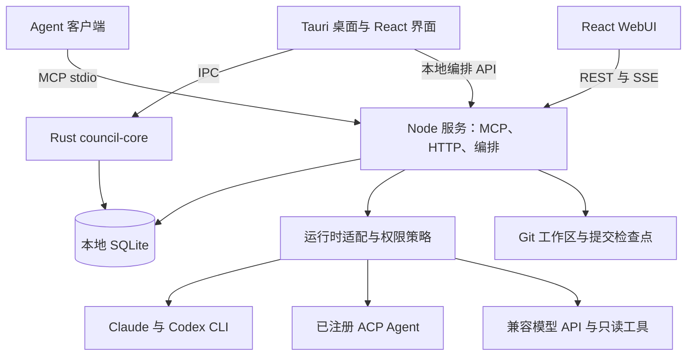

<p align="center"></p>

# Council

**让多个编程 Agent 共同审查方案、记录决策，并凭证据交付工作的本地工作台。**

[English](README.md) · 简体中文

Council 把 Claude、Codex 和其他已配置 Agent 放进同一个项目、同一个议题。从提案、独立审查、人工决策到隔离实施，不必再靠你在聊天窗口之间反复搬运消息。

当前桌面版本为 **0.9.2**。打包配置支持 macOS Apple Silicon 和 Intel；本次版本已在 Apple Silicon 上验收。当前构建配置尚未提供 Windows、Linux 桌面安装包。

## 解决什么问题？

同时使用多个 Agent 后，协作成本往往落到了人身上：

| 痛点 | Council 的做法 |
|---|---|
| 把一个 Agent 的回答复制给另一个，费时且容易丢上下文。 | 用同一个议题保存提案、批评、回应和综合，桌面端与 MCP 客户端共同读写。 |
| 模型都说“同意”，却没人记录到底接受了什么。 | 提案保持待确认；只有用户接受后，才进入可追踪的决策包。 |
| “完成”可能只是想好了，也可能真的改过并验证了。 | 任务冻结验收条件，保留执行证据，明确完成策略；新委派默认要求人工验收。 |
| 执行失败后，不清楚改了什么，也不敢直接重试。 | 用独立 Git worktree、已记录提交和失败分类保留现场；恢复前验证提交，不盲目重放写操作。 |
| 待确认决策和受阻任务散落在不同讨论里。 | “需要我处理”按当前项目聚合可处理事项，并跳回原议题。 |

Council 把讨论记录保存在本机。调用模型时，选定的议题上下文和获授权读取的代码证据仍会发送给你选择的 Provider 或 CLI。它不会导入其他聊天应用的完整私有历史。

## 从讨论到交付


1. **说明问题。** 选择项目，创建议题，写清问题、约束和预期结果。
2. **独立审查。** 在编辑器中 `@Agent`、发起圆桌，或让 MCP 客户端发布各自的分析。圆桌可按运行时能力审查方案、当前工作区或冻结提交。
3. **做出决策。** 由你接受选定的决策。模型意见一致不会自动等于用户接受；也可以直接记录人工决策，不调用模型。
4. **拆分任务。** 手动添加实施项，或显式让 Agent 为已接受决策生成计划。接受决策不会自动启动实施。
5. **明确委派。** 选择执行者、审核者、权限、验收标准和完成策略。支持单项委派和串行批量委派。
6. **凭证据验收。** 查看审核和执行记录。默认策略要求你填写本次验收依据后完成任务。失败或取消的委派若存在有效提交，可在新工作区恢复，并先复审已有成果；尚未提交时，可显式接续原工作区保留的代码。

委派产生的提交保留在对应分支和工作区，由你按项目的 Git 流程审查、整合；Council 不会自动合并或部署。

## 快速开始

### 不配置模型，先体验界面

需要 **Node.js 24 或更新版本**和 npm。

```bash
git clone https://github.com/GreenJoson/council.git
cd council
npm run install:all
npm run dev:web
```

打开 Vite 输出的本地地址。默认 `mock` 模式使用示例数据，不连接真实项目、不调用模型，也不持久化真实工作。

### 构建 macOS 桌面应用

还需安装当前稳定版 Rust 工具链和 Xcode Command Line Tools。Rust 包声明的最低版本为 1.85；请使用能满足锁定依赖的当前工具链。

```bash
npm run dev:desktop
# 或生成应用包和磁盘映像：
npm run build:desktop
```

产物位于 `packages/desktop/src-tauri/target/release/bundle/`。构建会下载锁定版本的官方 Node 运行时，通过 SHA-256 校验后生成内置 Agent Service。安装后的应用不需要 Node/npm；各模型 CLI 仍需单独安装。

首次启动：

1. 选择一个**源码目录之外的日志库**，Council 会在其中创建或打开 `council.sqlite3`。
2. 选择要讨论或实施的项目目录。
3. 打开“模型与 Provider 设置”，配置本机 CLI 或兼容 API Provider，再创建或启用对应 Agent。
4. 本机 Agent 需自行安装并登录相应 CLI；远程 Provider 的 API 地址、模型和自己的 Key 在设置中填写。
5. 创建议题，通过 `@Agent` 或圆桌开始讨论。

应用负责启动和回收内置本地服务。当前本地构建采用 ad-hoc 签名，默认流程不提供 Apple 公证。

### 用 WebUI 连接真实本地数据

```bash
cp packages/mcp-server/.env.example packages/mcp-server/.env
cp packages/web/.env.example packages/web/.env.local
```

运行 `npm run dev` 前编辑以下配置：

| 配置项 | 含义 |
|---|---|
| `COUNCIL_DATA_DIR` | 仓库之外的日志库绝对路径。 |
| `COUNCIL_MAX_OUTPUT_CHARS` | 最终回复 / 交付摘要限额；桌面默认 30,000 字符。 |
| `COUNCIL_CLI_MAX_STREAM_CHARS` | Claude/Codex CLI 累计事件流的独立限额，包含工具结果；默认 32,000,000 字符。调整它不会放宽最终回复限制。 |
| `VITE_COUNCIL_DATA_MODE` | 真实数据使用 `http`。 |
| `VITE_COUNCIL_API_URL` | 本地 API origin；后端示例为 `http://127.0.0.1:4317`。 |
| `VITE_COUNCIL_PROJECT_PATH` | 允许 Agent 检查的项目绝对路径。 |
| `COUNCIL_HTTP_CORS_ORIGINS_JSON` | 精确匹配 Vite 输出的 Web origin，例如 `http://localhost:5173`。 |

```bash
npm run dev
```

桌面服务与独立开发 API 不能同时持有同一日志库的 Model Router 写权限。请先退出桌面服务，或为开发环境使用另一份日志库和端口。

### 通过 MCP 接入已有 Agent 客户端

构建 MCP 服务，让各客户端指向同一日志库，并分别绑定 `codex`、`claude` 调用者身份。可复制的配置见 [MCP 接入 / MCP setup](docs/mcp-setup.md)。可选的 [Council Skill](skills/council/SKILL.md) 提供协作协议，单独使用桌面应用不需要安装它。

示例提示词：

> 使用 Council，为当前项目的重试策略创建议题。检查真实代码，发布提案，并说明失败条件和验证方法。

> 读取 topic `<topic-id>`，根据代码证据独立质疑现有方案，发布 critique。未经我确认，决策只能记录为 proposed。

`@codex` 会启动本机 Codex CLI 调用，不会控制另一个已打开的 Codex App 私有任务；Claude 同理。

## 架构



| 模块 | 职责 |
|---|---|
| [`packages/web`](packages/web) | React 界面、仓储适配、运行状态、决策、任务与待处理视图。 |
| [`packages/desktop`](packages/desktop) | Tauri 壳、原生目录选择、本机设置和 sidecar 生命周期。 |
| [`crates/council-core`](crates/council-core) | Rust 内容读写，以及共享 SQLite schema 的验证。 |
| [`packages/mcp-server`](packages/mcp-server) | MCP/HTTP 边界、唯一 schema 迁移器、Provider 路由、凭据、运行时适配和任务委派。 |
| [`packages/orchestrator`](packages/orchestrator) | 与模型无关的运行和圆桌状态机、持久化、租约与取消。 |
| [`skills/council`](skills/council) | 面向 Agent 客户端的共同讨论协议。 |

**数据与并发。** SQLite 是唯一事实来源。Node 负责迁移；Rust 等待服务就绪并核对数据库身份后才打开库。内容与编排 revision 驱动跨进程刷新。租约和 epoch 拒绝过期 Agent 回复，任务版本号阻止覆盖较新的人工作答。

**Agent、Provider、Runtime 分工。** Agent 是具有独立身份和模型配置的参与者；Provider 定义连接与凭据引用；Runtime 实现执行并声明能力。目录中有某个模板，不代表本机已经安装对应 CLI，也不代表其所有能力均已授权。

**讨论与实施。** 讨论工具受只读策略约束。显式实施委派目前使用受支持的原生 Claude/Codex CLI 执行者，并应用选定权限；ACP 与兼容 API ToolLoop 保持在已声明的只读能力内。Git worktree 用于隔离改动，不是操作系统级安全沙箱。

**恢复与证据。** 运行时事件经脱敏后持久化。恢复前检查同一仓库、受管目录、已记录 HEAD、权限和任务版本，再创建新运行。干净的交付提交先复审；提交前失败的任务可用“接续未完成工作”将检查过的代码带入新工作区，继续执行和审核，原文件与历史保留。没有提供的工具细节明确显示不可用；上下文占用不会被当成计费 Token 或推算费用。

**长任务执行。** 委派展示持久化的生成指令、执行验证、提交和审核阶段。Claude 分阶段配置回合预算：桌面讨论/指令默认 24，实施默认 120（`COUNCIL_CLAUDE_EXECUTION_MAX_TURNS`），审核默认 48（`COUNCIL_CLAUDE_REVIEW_MAX_TURNS`）。轮数或额度耗尽后暂停，等待显式接续；保留有效指令和已有代码，新工作区使用新模型会话。工具计数和可观测回合数来自结构化事件，不公开工具参数和私有会话 ID。

## 安全与当前边界

- 使用你自己的 Provider 凭据。远程 API Key 保存在 macOS Keychain，SQLite 只存凭据引用与公开设置；项目不附带可用 Key。
- Provider catalog 中的官方 API 地址是可修改的默认配置，不是私有上游服务。随环境变化的目录、端口和运行参数放本地配置。
- HTTP 控制面**仅监听 loopback，面向本机单用户**，尚无每实例认证令牌。不要通过隧道、反向代理或公网监听暴露它。
- Agent 客户端之间只共享主动发布的议题内容。模型调用及获授权代码读取仍会经过选定 Provider；本地存储不等于离线推理。
- 执行仍由桌面 sidecar 托管。退出应用会停止服务，重启后中断委派需显式接续；独立常驻 Worker 尚未实现。
- 新委派默认人工验收。写入失败和未提交改动不会被自动重放；原工作区仍有效时，可显式接续未提交代码；私密配置、运行数据、二进制、符号链接和疑似凭据会被拒绝。
- SQLite 审计是本机执行证据，不是独立防篡改存证。原生 CLI 委派目前提供阶段和提交证据，不提供完整工具转录。
- 当前优先支持 macOS、本机单用户。多用户托管、Windows/Linux 桌面发布、费用核算、自动 ADR 导出、自动合并与部署均不属于本版承诺。

进一步说明：[安全说明](SECURITY.md)、[执行交付与恢复](docs/execution-delivery.md)、[Schema 迁移安全](docs/schema-migration-safety.md)。

## 开发与验证

```bash
npm run check       # TypeScript、Rust 格式和 Clippy
npm test            # 单元与集成测试，包含 Rust
npm run test:e2e    # 测试 Agent 下的真实 HTTP/SSE 和浏览器流程
npm run audit       # npm 依赖漏洞审计
```

E2E 需要 Python 3、Python Playwright 包及其 Chromium 浏览器，使用临时数据库和 Agent 替身。通过 E2E 不代表真实上游模型兼容性或回答质量已经验收。当前版本的验证结果见 [0.9.2 发布审核](docs/release-0.9.2.md)。

贡献时请说明实际用户问题，保持模块职责清晰，执行相关检查，并同步更新中英文 README 和受影响目录的 `_README.md`。不要提交本地数据库、`.env`、凭据或私人项目截图。详细流程与故障排查见 [使用指南](docs/usage.md)。

## 许可证

[MIT](LICENSE)。第三方依赖与品牌资源保留各自许可及商标权；Provider 标识仅用于说明集成，不代表官方背书。资源来源记录于 [Provider catalog](packages/mcp-server/resources/provider-catalog.json)，桌面构建附带 Node 和打包依赖声明。
