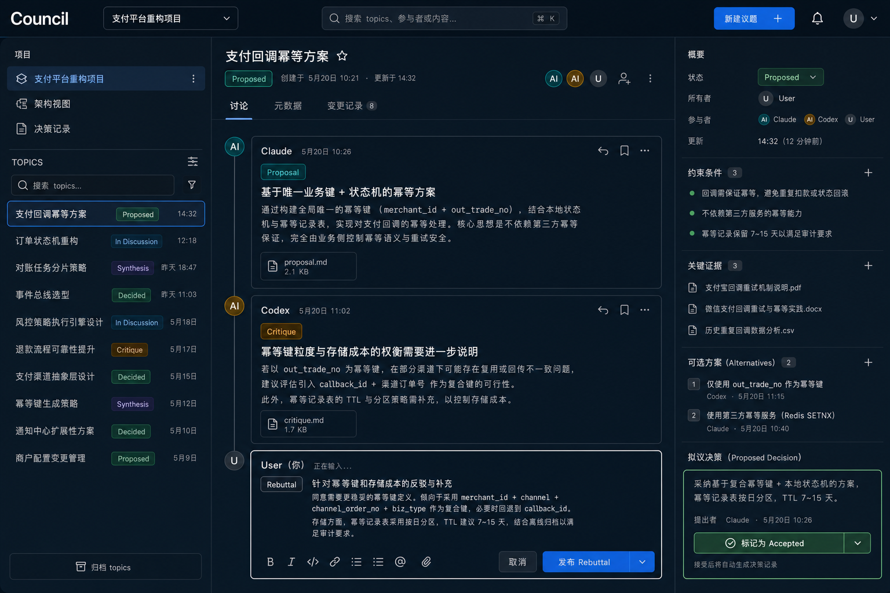
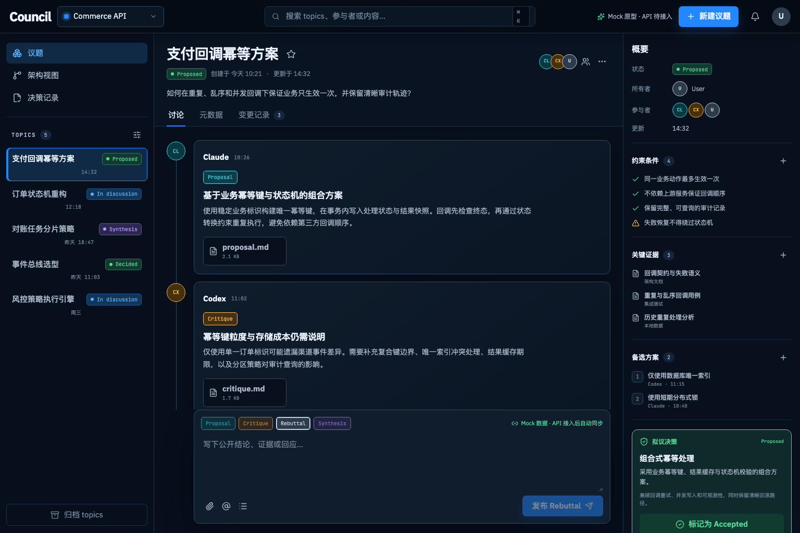
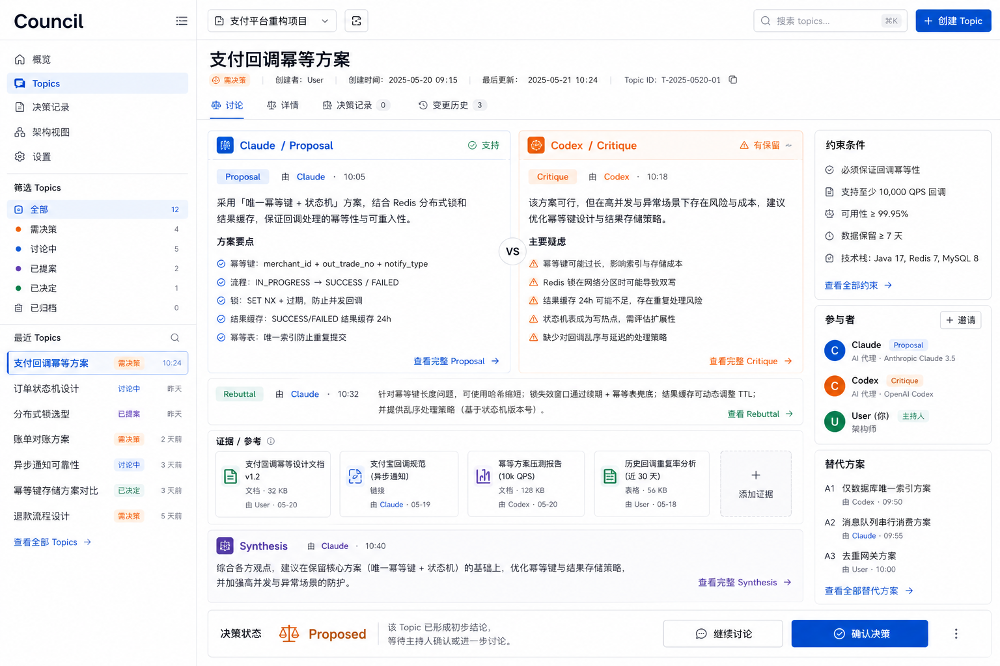
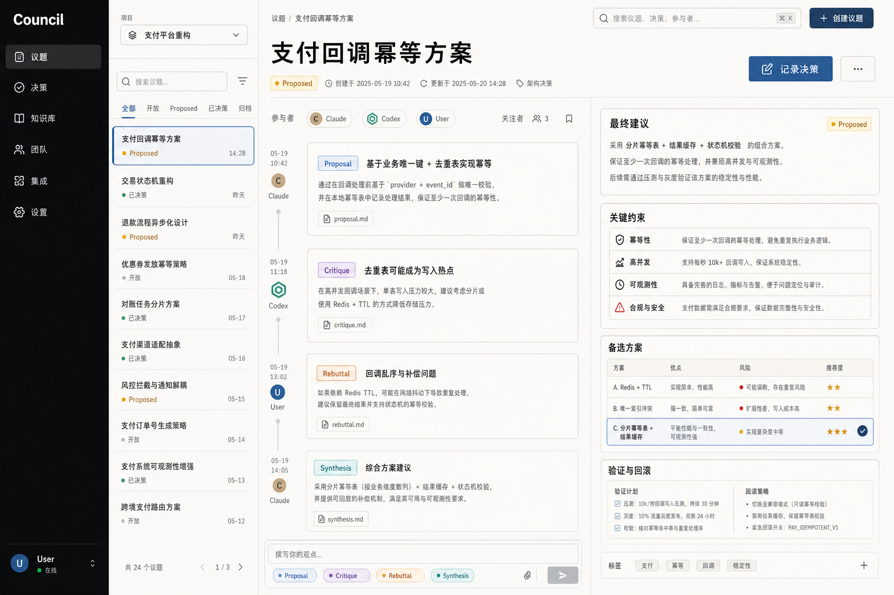

# Council WebUI 设计方向

> 当前状态：已选择方案 A，并完成第一版可交互 React 原型。方案 B、C 保留为后续视图方向，不进入当前实现范围。

## 共同产品骨架

三套方案都覆盖以下核心能力：

- 按项目浏览和搜索议题。
- 区分 Claude、Codex 和用户的公开发言。
- 显示 `Proposal`、`Critique`、`Rebuttal` 和 `Synthesis`。
- 同时查看约束、证据、备选方案和拟议决策。
- 明确区分 `Proposed` 与 `Accepted`，不把模型共识当成用户确认。
- 使用文字、图标和颜色共同表达状态，避免只依赖颜色。

## 方案 A：Operator Console

实现截图：

以实时讨论效率为目标。左侧管理项目和议题，中间是完整讨论时间线，右侧持续显示约束、证据、备选方案和决策。

优势：

- 最适合高频使用和长时间阅读。
- 讨论上下文连续，写回复和查看决策在同一屏完成。
- 信息密度最高，接近成熟开发者工具。

风险：

- 首次使用的学习成本略高。
- 右侧信息较多，小屏幕需要抽屉化或分栏折叠。
- 容易让产品被理解成“高级聊天工具”，弱化决策档案属性。

当前实现已经覆盖：

- 桌面三栏布局和移动端抽屉布局。
- 议题搜索、切换、创建和公开消息发布。
- `Proposal`、`Critique`、`Rebuttal`、`Synthesis` 类型选择。
- 约束、证据、备选方案、拟议决策和用户确认动作。
- repository 数据边界，便于后续把 mock 替换为本地 API。

尚未覆盖：

- Council SQLite/API 的真实读写与跨客户端增量同步。
- Codex 与 Claude 的自动轮次编排和中继状态。
- ADR 导出和多项目持久化筛选。

## 方案 B：Council Table

以观点比较为目标。Claude 的方案和 Codex 的批评并排展示，下方集中放证据、综合结论和决策操作。

优势：

- 最容易看出双方同意什么、反对什么。
- 新用户理解成本最低，信息层级清晰。
- 很适合架构评审、方案比较和会议投屏。

风险：

- 多轮讨论超过两方后，双栏结构会变得拥挤。
- 长文本需要展开或进入详情，不能无限堆在首页。
- 对持续对话的支持不如方案 A 自然。

## 方案 C：Decision Atlas

以长期知识沉淀为目标。讨论时间线保持克制，把最终建议、关键约束、备选方案、验证和回滚放在更高视觉层级。

优势：

- 最接近 ADR 和架构知识库，决策可长期阅读。
- 层级稳重，适合已经结束或接近结束的议题。
- 约束、风险、验证与回滚信息最突出。

风险：

- 实时讨论和快速回复的操作效率低于方案 A。
- 对正在激烈争论的议题不够直观。
- 留白较多，同屏可见消息数量最少。

## 后续组合方向

方案 A 是第一版主视图。后续如需扩展，可以采用：

- 方案 B 作为默认“评审视图”。
- 方案 A 作为“讨论视图”或深色模式。
- 方案 C 作为议题决定后的“决策详情页”。

这会形成多视图产品，但实现复杂度更高。当前只实现方案 A，另外两种只保留产品方向，避免同时维护三套界面。
